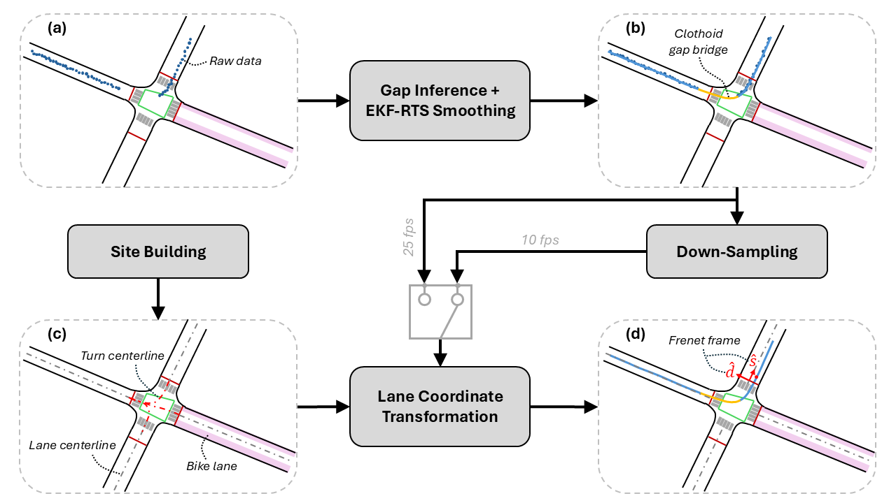
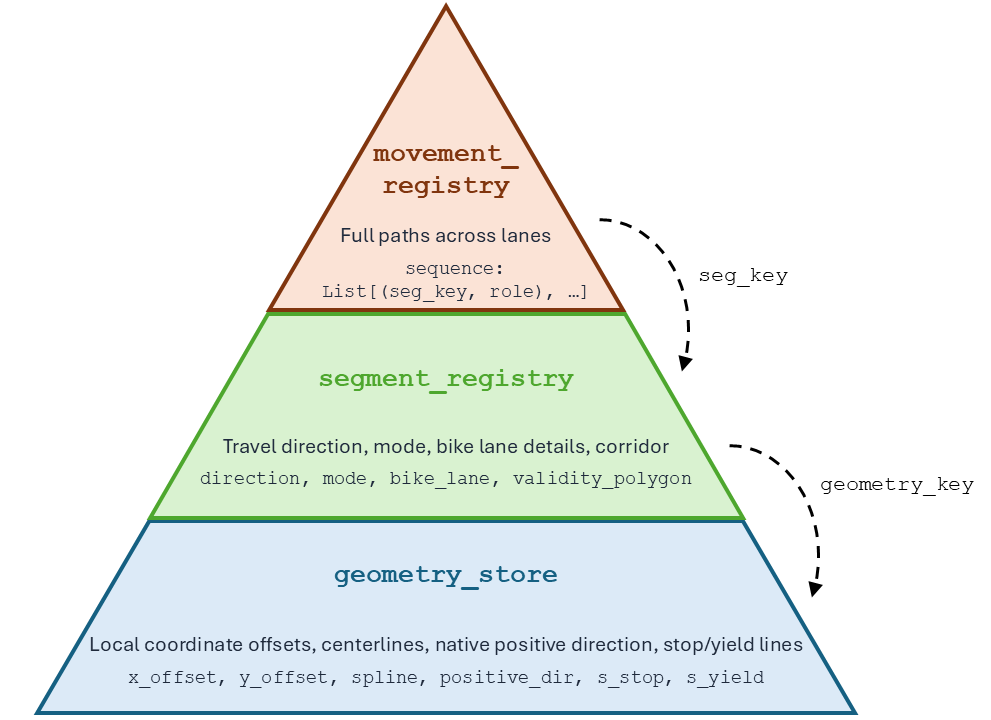

# BikeZ-ETH Data Post-Processing

<p align="center">
  <a href="https://shaimaa-elbaklish.github.io/bikeZ_processing/assets/dashboard.html"></a>
  <a href="https://www.bikez.ethz.ch/"></a>
  <a href="src/tutorial.ipynb"></a>
  <a href="src/viz_tutorial.ipynb"></a>
</p>

<p align="center">
  <br>
  <em>Figure 1: Trajectory processing pipeline for the BikeZ-ETH dataset.</em>
</p>

## Contents

- [Installation](#installation)
- [Setup and Configuration](#setup-and-configuration)
- **Data Post-Processing**
    - [Gap Inference + EKF-RTS Smoothing Algorithm](#data-post-processing-gap-inference--ekf-rts-smoothing-algorithm)
    - [Down-sampling](#data-post-processing-down-sampling)
    - [Lane Coordinate Transformation](#data-post-processing-lane-coordinate-transformation)
- **Data Visualization**
    - [HTML Animation Tools](#data-visualization-tools)
    - [Interactive Dashboard ↗](https://shaimaa-elbaklish.github.io/bikeZ_processing/assets/dashboard.html)
- **Examples**
    - [Data Usage Tutorial ↗](src/tutorial.ipynb)
    - [Visualization Tutorial ↗](src/viz_tutorial.ipynb)
- [Acknowledgements](#acknowledgements)
- [Data Availability](#data-availability)
- [Publications](#publications)


## Installation

This project was developed on Windows (win-64) with **Python 3.13**, and has also been verified to install cleanly on **Python 3.11+**.

1. Create and activate a virtual environment:
    ```bash
    python -m venv bicycles

    # Windows
    bicycles\Scripts\activate

    # macOS/Linux
    source bicycles/bin/activate
    ```
    *OR* create a conda environment:
    ```bash
    conda create -n bicycles python=3.11
    conda activate bicycles
    ```

2. Install dependencies:
    ```bash
    pip install -r pip_requirements.txt
    ```

### Notes
- Dependency resolution has been tested on Windows for Python 3.11–3.13. If installing on Linux/macOS, some packages may require the system libraries noted below to build successfully.
- Some packages (`fiona`, `geopandas`, `pyproj`, `h5py`) depend on system libraries such as GDAL, PROJ, and HDF5. On Linux, install these via your package manager first (e.g. `apt install gdal-bin libgdal-dev proj-bin libhdf5-dev` on Debian/Ubuntu) if the pip install fails to build them.
- `gurobipy`, `mosek`, and `xpress` are commercial solvers included as dependencies. The packages will install, but you'll need valid licenses to use them.


## Setup and Configuration
The BikeZ-ETH dataset configuration settings are summarized in the `BikeZ_Config` dataclass in `_constants.py` file.

**Change the root path of the data directory, i.e. the variables `dir_root`, `data_root`, and `subsampled_data_root`.**
```python
@dataclass
class BikeZ_Config:
    dir_root: str = "/usr/path/to/BikeZ/"                                        # <-- CHANGE HERE! -->
    data_root: Dict = field(default_factory=lambda: {
        "Zurich_202506": {
            "bike": "/usr/path/to/BikeZ/Zurich_202506/bike_trajectories/v2/",    # <-- CHANGE HERE! -->
            "vehicle": "/usr/path/to/BikeZ/Zurich_202506/vehicle_trajectories/"  # <-- CHANGE HERE! -->
        },
        "Zurich_202509": {
            "bike": "/usr/path/to/BikeZ/Zurich_202509/bike_trajectories/",       # <-- CHANGE HERE! -->
            "vehicle": "/usr/path/to/BikeZ/Zurich_202509/vehicle_trajectories/"  # <-- CHANGE HERE! -->
        }
    })
    subsampled_data_root: str = "/usr/path/to/BikeZ-Subsampled/"                 # <-- CHANGE HERE! -->
```

This is a summary of the available files.

| Date       | Intersection | Code | Timeslot                                                   | Street(s)                                                        | Location Number |
|------------|--------------|------|------------------------------------------------------------|------------------------------------------------------------------|-----------------|
| 2025-06-16 | D1           | A    | AM1, AM2, AM3, AM4, AM5, AM6, PM1, PM2, PM3, PM4, PM5, PM6 | Langstrasse – Zollstrasse – Röntgenstrasse                       | 4               |
| 2025-06-16 | D2           | G    | AM1, AM2, AM3, AM4, AM5, AM6                               | Zollstrasse – Ackerstrasse – Mattengasse                         | 5               |
| 2025-06-16 | D2           | C    | PM1, PM2, PM3, PM4, PM5, PM6                               | Zollstrasse – Ackerstrasse – Mattengasse                         | 5               |
| 2025-06-16 | D3           | E    | AM1, AM2, AM3, AM4, AM5, AM6, PM1, PM2, PM3, PM4, PM5, PM6 | Kasernenstrasse – Lagerstrasse – Gessnerbrücke                   | 2               |
| 2025-06-16 | D4           | F    | AM1, AM2, AM3, AM4, AM5, AM6, PM1, PM2, PM3, PM4, PM5, PM6 | Gessnerbrücke – Gessnerallee – Usteristrasse                     | 3               |
| 2025-06-17 | D1           | A    | AM1, AM2, AM3, AM4, AM5, AM6                               | Langstrasse – Zollstrasse – Röntgenstrasse                       | 4               |
| 2025-06-17 | D1           | B    | PM1, PM2, PM3, PM4, PM5, PM6                               | Langstrasse – Zollstrasse – Röntgenstrasse                       | 4               |
| 2025-06-17 | D2           | C    | AM1, AM2, AM3, AM4, AM5, AM6, PM1, PM2, PM3, PM4, PM5, PM6 | Zollstrasse – Ackerstrasse – Mattengasse                         | 5               |
| 2025-06-17 | D3           | E    | AM1, AM2, AM3, AM4, AM5, AM6, PM1, PM2, PM3, PM4, PM5, PM6 | Kasernenstrasse – Lagerstrasse – Gessnerbrücke                   | 2               |
| 2025-06-17 | D4           | F    | AM1, AM2, AM3, AM4, AM5, AM6, PM1, PM2, PM3, PM4, PM5, PM6 | Gessnerbrücke – Gessnerallee – Usteristrasse                     | 3               |
| 2025-09-29 | D1           | A    | AM1, AM2, AM3, AM4, AM5, AM6                               | Quaibrücke - Bürkliplatz                                         | 6               |
| 2025-09-29 | D1           | C    | PM1, PM2, PM3, PM4, PM5, PM6                               | Duttweilerbrücke – Hohlstrasse – Herdernstrasse                  | 8               |
| 2025-09-29 | D2           | B    | AM1, AM2, AM3, AM4, AM5, AM6                               | Bullingerplatz                                                   | 7               |
| 2025-09-29 | D2           | E    | PM1, PM2, PM3, PM4, PM5, PM6                               | Herdernstrasse – Bullingerstrasse – Baslerstrasse                | 9               |
| 2025-09-30 | D1           | G    | AM1, AM2, AM3, AM4, AM5, AM6                               | Birmensdorferstrasse – Schweighofstrasse – Schaufelbergerstrasse | 11              |
| 2025-09-30 | D1           | H    | PM1, PM2, PM3                                              | Baslerstrasse – Freihofstrasse                                   | 12              |
| 2025-09-30 | D2           | F    | AM1, AM2, AM3, AM4, AM5, AM6                               | Birmensdorferstrasse – Gutstrasse – Talwiesenstrasse             | 10              |
| 2025-09-30 | D2           | I    | PM1, PM2, PM3                                              | Baslerstrasse – Flurstrasse                                      | 13              |
---


## Data Post-Processing: Gap Inference + EKF-RTS Smoothing Algorithm

Run for a single csv trajectory data file by executing:
```bash
python main_kf.py %DATE% %VEH_TYPE% %INTERSECTION% %CODE% %TIMESLOT% %DEBUG_FLAG%
```
where `%VEH_TYPE%` denotes the mode which can be `bike` or `vehicle`. The other arguments are as per the summary table above.
For example:
```bash
python main_kf.py 2025-06-16 bike D3 E AM2 False
```

Or, you can run for the entire dataset via the batch script `run_kf.bat`.

Regarding `%DEBUG_FLAG%`, it should be `False` when running an entire dataframe since it produces ~5 figures per `veh_id`. It should only be `True` when debugging a single instance of `veh_id`, i.e. using `test_kf.py`.


### Outputs
The output is a parquet file saved in the same location as the original file. It has the naming convention:
```
<original-filename>-ekf.parquet
Example Original File: trajectories_bikes_2025-06-16_D3_AM1_E-1.csv
---> Output File: trajectories_bikes_2025-06-16_D3_AM1_E-1-ekf.parquet
```

| Column            | Description                                                                                                                                                                   |
| ----------------- | ----------------------------------------------------------------------------------------------------------------------------------------------------------------------------- |
| `veh_id`          | Unique vehicle (bike) identifier (same as original)                                                                                                                           |
| `veh_type`        | Vehicle type (same as original)                                                                                                                                               |
| `time`            | Time (in seconds) from when the drone started recording                                                                                                                       |
| `datetime`        | Global timestamp string                                                                                                                                                       |
| `x_act`, `y_act`  | Original X and Y positions (meters) in EPSG:2056 projected coordinate system                                                                                                  |
| `speed`           | Original estimated speed (km/h)                                                                                                                                               |
| `a`               | Original estimated acceleration (m/s<sup>2</sup>)                                                                                                                             |
| `lat`, `lon`      | Latitude and longitude of bike position                                                                                                                                       |
| `x`, `y`          | Offset-corrected X and Y positions (meters), where `x = x_act - x_offset` and `y = y_act - y_offset` (offsets defined per location in `_constants.py` for numerical stability) |
| `angle`           | Estimated heading angle (rad)                                                                                                                                                 |
| `angular_vel`     | Estimated angular velocity (rad/s)                                                                                                                                            |
| `angvel_clipped`  | Boolean flag indicating whether angular velocity was clipped (threshold: 3 rad/s)                                                                                             |
| `missing`         | Boolean flag indicating missing data in the original file                                                                                                                     |
| `x_ekf`, `y_ekf`  | EKF-smoothed X and Y offset positions (meters)                                                                                                                                |
| `speed_ekf`       | EKF-smoothed speed (km/h)                                                                                                                                                     |
| `a_ekf`           | EKF-smoothed acceleration (m/s<sup>2</sup>)                                                                                                                                   |
| `angle_ekf`       | EKF-estimated heading angle (rad)                                                                                                                                             |
| `angular_vel_ekf` | EKF-estimated angular velocity (rad/s)                                                                                                                                        |
---


## Data Post-Processing: Down-Sampling
The trajectory dataset is downsampled to **10 fps** on a homogenous master time-grid *shared between bicycles and vehicles*.

Run for a single csv trajectory data file by executing:
```bash
python main_subsampling.py %DATE% %VEH_TYPE% %INTERSECTION% %CODE% %TIMESLOT% %DEBUG_FLAG%
```
where `%VEH_TYPE%` denotes the mode which can be `bike` or `vehicle`. The other arguments are as per the summary table above.
For example:
```bash
python main_subsampling.py 2025-06-16 bike D3 E AM2 False
```
Or, you can run for the entire dataset via the batch script `run_subsampling.bat`.

### Outputs

The output is a parquet file saved in the specified output path, with the naming convention: `locationNumber_mode_date_timeslot.parquet`
| Column | Description |
| --- | --- |
| `veh_id` | Unique vehicle (bike) identifier (same as EKF output) |
| `veh_type` | Vehicle type (same as EKF output) |
| `time` | Time (in seconds) from when the drone started recording, on a uniform 0.1 s grid |
| `datetime` | Global timestamp string, recomputed from interpolated `time` |
| `x_act_ekf`, `y_act_ekf` | Cubic-spline-interpolated EKF-smoothed X and Y positions (meters) in EPSG:2056 projected coordinate system, where `x_act_ekf = x_ekf + x_offset`, and similarly for `y_act_ekf` |
| `x_ekf`, `y_ekf` | Cubic-spline-interpolated EKF-smoothed X and Y offset positions (meters) |
| `lon_ekf`, `lat_ekf` | Longitude and latitude of the interpolated EKF position, reprojected from EPSG:2056 to EPSG:4326 |
| `speed_ekf` | Linearly interpolated EKF-smoothed speed (km/h), clamped $\geq$ 0 |
| `a_ekf` | Linearly interpolated EKF-smoothed acceleration (m/s<sup>2</sup>) |
| `angle_ekf` | Linearly interpolated EKF-estimated heading angle (rad), wrapped to (-$\pi$, $\pi$] |
| `angular_vel_ekf` | Linearly interpolated EKF-estimated angular velocity (rad/s) |
| `in_gap` | True if this row is interpolated during an occlusion gap interval that was inferred in the previous step (i.e. Gap Inference + EKF-RTS Smoothing). |
| `off_grid` | True if this row is NOT an exact member of the shared master grid (i.e. a spliced-in head/tail from include_heads/include_tails, or the forced fallback point for an empty-window trajectory). |
---


## Data Post-Processing: Lane Coordinate Transformation
Run for a single csv trajectory data file by executing:
```bash
python main_coordinate_transform.py %DATE% %VEH_TYPE% %INTERSECTION% %CODE% %TIMESLOT% %SUBSAMPLED_FLAG% %DEBUG_FLAG%
```
where `%VEH_TYPE%` denotes the mode which can be `bike` or `vehicle`, and the `%SUBSAMPLED_FLAG%` denotes whether to transform the downsampled **10 fps** data (if `True`) or the original data at 25 fps.
The other arguments are as per the summary table above.
For example:
```bash
python main_coordinate_transform.py 2025-06-16 bike D3 E AM2 False False
```
Or, you can run for the entire dataset via the batch script `run_coordinate_transform.bat`.

### Outputs
The output is a parquet file saved in the same location as the original file if `%SUBSAMPLED_FLAG%` is `False`. It has the naming convention:
```
<original-filename>-ekf-lane.parquet
Example Original File: trajectories_bikes_2025-06-16_D3_AM1_E-1.csv
---> Output File: trajectories_bikes_2025-06-16_D3_AM1_E-1-ekf-lane.parquet
```
If `%SUBSAMPLED_FLAG%` is `True`, the output **csv** file is saved in the specified output path, with the naming convention: `locationNumber_mode_date_timeslot_lane.csv`

The following output columns are added.

| Column | Type | Description |
|---|---|---|
| `movement_key` | str | e.g. `'LangstrN_SB_2_LangstrS_SB'` |
| `segment_id` | str | e.g. `'LangstrS_SB'` |
| `segment_type` | str | `'lane'` or `'turn'` or `'ring'` |
| `segment_role` | str | `'approach'`, `'turn'`, `'ring'`, `'departure'` |
| `match_quality` | str | `'good'`, `'poor'`, `'fallback'`, `'unmatched'` |
| `is_fallback` | bool | polygon matched mid-fragment |
| `is_reverse` | bool | cyclist against segment direction |
| `s_native` | float | arc-length along spline [m], 0 $\rightarrow$ L, **invertible** |
| `d_native` | float | lateral offset, left of spline = + [m], **invertible** |
| `s` | float | directed s [m], increases in travel direction |
| `d` | float | lateral offset, left of travel = + [m] |
| `s_dot` | float | longitudinal speed [m/s] |
| `d_dot` | float | lateral speed [m/s] |
| `s_ddot` | float | longitudinal acceleration [m/s<sup>2</sup>] |
| `d_ddot` | float | lateral acceleration [m/s<sup>2</sup>] |
| `in_bike_lane` | uint8 | 1 / 0 / NaN |
| `d_to_bike_boundary` | float | distance from bike lane inner boundary [m] |
| `car_lane_idx` | Int64 | matched car lane index, `<NA>` where in bike lane, not a `'lane'` segment, or no bin matched |

**Notes:** 
- `(s_native, d_native, segment_id)` is the **invertible** triple $\rightarrow$ recovers `(x, y)`.
- `speed_ekf` is also converted from km/h to m/s in this step, so its units differ from the down-sampling output above.
- For `%SUBSAMPLED_FLAG%=True`, the CSV output retains only `s_native`/`d_native`; the directed `s`/`d` columns are dropped. They can be recomputed **per trajectory** with the function `compute_travel_directed_s_d(bike_df, segment_registry, geometry_store)`.
    ```python
        from tools_lane_coords_V5 import compute_travel_directed_s_d

        df = df.groupby('veh_id', group_keys=False).apply(
            lambda g: compute_travel_directed_s_d(g, segment_registry, geometry_store)
        )
    ```
    The function reads `segment_id`, `segment_role`, `is_reverse`, `s_native`, `d_native`, `x_ekf`, `y_ekf`; all retained in the CSV. It also adds `cumulative_s`: longitudinal position stitched continuously across segment boundaries [m], with ring runs unwrapped so a second lap accumulates rather than resetting.

### Overview

The lane coordinate transform maps raw GPS trajectories from global EPSG:2056 `(x, y)` coordinates to road-aligned `(s, d)` coordinates at each intersection. The transform is built on three registries, constructed once per site using `tools_site_builder.py` and saved as a pickle file.

<table style="border: none; border-collapse: collapse;">
<tr>
<td style="border: none; vertical-align: top;">

- **`geometry_store`** : one entry per physical road axis. Stores the B-spline fit to the road centerline, total arc length, stop/yield line positions (`s_stop`, `s_yield`, `s_change`), intersection area polygons, and local coordinate offsets.
- **`segment_registry`** : one entry per directed travel segment (e.g. `LangstrS_NB`, `turn_LangstrS_NB_2_LangstrN_NB`). Stores segment type (`lane` or `turn`), travel direction, lateral validity bounds (`d_left`, `d_right`), validity polygon, and mode (`shared`, `bike`, or `car`). Also, contains bike lane details (`bike_lane`), as well as car lane lateral bounds (`car_lane_d_bnd`).
- **`movement_registry`** : one entry per observable movement through the intersection (e.g. `LangstrN_SB_2_LangstrS_SB`). Each entry is an ordered sequence of `(segment_key, role)` pairs: approach lane $\rightarrow$ turn $\rightarrow$ departure lane.

</td>
<td width="400" align="center" style="border: none; vertical-align: top;">
  <br>
  <em>Figure 2: Schematic diagram of the registry map layers.</em>
</td>
</tr>
</table>

At runtime, `to_lane_coordinates` (in `tools_lane_coords_V5.py`) walks each trajectory through these registries, proposing candidate breakpoints from gate crossings and polygon transitions, then selecting the segment chain by dynamic programming, and computing the full `(s, d, s_dot, d_dot, s_ddot, d_ddot)` decomposition.

**Segment key conventions:** lane segment keys follow `{Road}_{Direction}` (e.g. `LangstrS_NB`); turn segment keys follow `turn_{approach_seg}_2_{departure_seg}` (e.g. `turn_LangstrS_NB_2_LangstrN_NB`). All valid keys are listed in `segment_registry`.

### Forced matching and transformation
When desired, the chain can be specified manually using `to_lane_coordinates_forced`:
```python
from tools_lane_coords_V4 import to_lane_coordinates_forced

bike_df = to_lane_coordinates_forced(
    bike_df,
    forced_chain=['LangstrS_NB', 'turn_LangstrS_NB_2_LangstrN_NB', 'LangstrN_NB'],   # <-- CHANGE AS DESIRED -->
    segment_registry=segment_registry,
    geometry_store=geometry_store,
    movement_registry=movement_registry,
    verbose=True,
)
```
The `forced_chain` is an ordered list of segment keys exactly as they appear in `segment_registry`. The function skips polygon walk and scoring, takes the chain as ground truth, and performs the full geometric transformation (i.e. handoff detection, `(s, d)` computation, speed and acceleration decomposition) identical to the automatic pipeline.
Output columns are the same as `to_lane_coordinates`, with `match_quality='forced'` for all matched rows.

**When to use:**

- Very short trajectories (< ~20 points) where polygon scoring is unreliable.
- Ground-truth labelling for validation or downstream analysis.

<!--- **To include in main pipeline:** add desired vehicle or bicycle IDs into the csv file `./data/forced_transforms.csv`. --->

---

## Data Visualization Tools

### `generate_debug_viz.py`: Per-trajectory lane coordinate debug map

Interactive single-file HTML visualisation for one bicycle trajectory after `to_lane_coordinates()`. Combines a Leaflet satellite map with three linked Plotly panels, all driven by a shared playback animation.

**Usage**

```python
from generate_debug_viz import generate_bikelane_debug_map

generate_bikelane_debug_map(
    bike_df,                                # DataFrame after to_lane_coordinates(), single vehicle
    segment_registry,
    geometry_store,
    output_path='debug_bikelane_map.html',  # optional
    n_spline_pts=300,                       # optional, spline sampling resolution
)
```

**Left panel: Leaflet / swisstopo satellite map**

Togglable layer groups (via top-right layer control):
- Centerlines: Full spline for each matched segment; dashed for turns
- Validity polygons: Oriented corridor polygon per segment
- Change points: `s_change` marker on the centerline
- Bike lane bands: Inner boundary + outer edge + filled band
- Trajectory: GPS path coloured by `segment_id`

**Right panel: three linked Plotly charts**

| Plot | X-axis | Y-axis | Notes |
|---|---|---|---|
| A. Cumulative s vs d | Continuous s stitched across segment boundaries [m] | d [m] | vrect shading for `is_reverse` (salmon) and `in_bike_lane` (green) |
| B. s_native vs d_native | s_native [m] | d_native [m] | One trace per segment; time is the animation dimension |
| C. Speed, $\dot{s}$ , $\dot{d}$ vs time | t [s] | m/s | `speed_ekf` grey dashed; `s_dot` / `d_dot` solid/dotted per segment colour; vrect flags |

Click any plot to jump the scrubber to that position. All panels share the same segment colour palette.

**Required `bike_df` columns** (all produced by `to_lane_coordinates()`): <br>
`x_act_ekf`, `y_act_ekf`, `x_ekf`, `y_ekf`, `time`, `speed_ekf`,
`s`, `d`, `s_native`, `d_native`, `s_dot`, `d_dot`,
`segment_id`, `segment_role`, `movement_key`, `is_reverse`, `in_bike_lane`

---

### `generate_timestamped_map.py`: Fleet-wide animated trajectory map

Command-line script that renders all bicycle and vehicle trajectories at a given site and timeslot as an animated Leaflet map using `TimestampedGeoJson`.
Bikes appear as small blue circles; vehicles as slightly larger red circles.
History points fade to low opacity so the current frame remains visually dominant.

**Usage**

```bash
python generate_timestamped_map.py %DATE% %INTERSECTION% %CODE% %TIMESLOT% %SUBSAMPLED_FLAG% %HISTORY_LENGTH%

# Example
python generate_timestamped_map.py 2025-06-16 D3 E AM1 True 1
```
where `%HISTORY_LENGTH%` (integer) is the number of history seconds to display behind each point's current position. `0` shows only the current position for each bike/vehicle, with no trailing history. `1`, `2`, etc. extend how many preceding seconds of trajectory remain visible at each frame.

Output is saved to `../maps/timestamped_trajectories_ALL_map_<date>_<intersection>_<timeslot>_<code>_history<history_len>s.html`.

---

## Acknowledgements

We thank the organization *Pro Velo Kanton Zürich* for promoting the field experiment to recruit participants. Moreover, we thank the following supporters that facilitated the experiment on Baslerstrasse: Linghang Sun at ETH Zürich and Anastasia Psarou at Jagiellonian University.

Research was funded by the "BikeZ: Model Suite for Mass Cycling as a Service Simulation" Innovation project supported by Innosuisse (grant agreement: 123.077 IP-SBM). We would also like to thank the advisory committee members of this project, Dr. Lukas Ambühl at Transcality AG, Dr. Athina Tympakianaki at Aimsun, and Dr. Manos Barmpounakis at MobiLysis Sàrl, for the insightful advice.

---

## Data Availability

BikeZ-ETH Dataset available on Zenodo via the DOI: [10.5281/zenodo.22089103](https://doi.org/10.5281/zenodo.22089103).

---

## Publications

```
BikeZ-ETH: Multi-modal trajectory data and empirical analysis of urban traffic flow characteristics (2026).
El-Baklish, S.K. and Ni, Y-C. and Ramseier, T. and Riehl, K. and Kouvelas, T. and Makridis, M.
(To Be Submitted)
```

```
Quantifying Bicycle Flow Efficiency: Inference of the Fundamental Diagram from Experimental Observations (2026).
El-Baklish, S.K. and Ni, Y-C. and Riehl, K. and Kouvelas, T. and Makridis, M.
(In Review in Nature Communications)
```